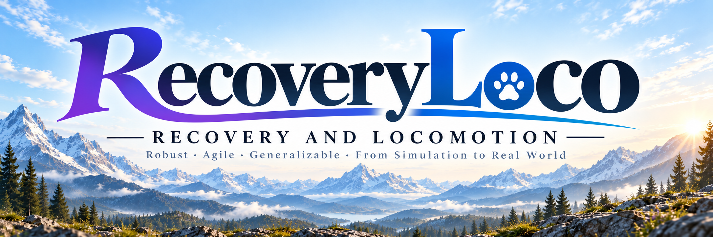
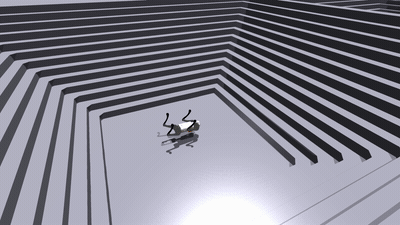
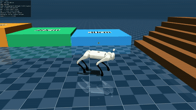
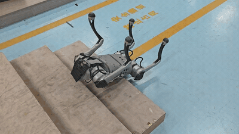

<p align="center">
  
</p>

| Isaac Gym | MuJoCo | Physical |
|--- | --- | --- |
|  |  |  |

<div align="center">
  <h1 align="center">RecoveryLoco</h1>
  <p align="center">
    <span>🌎 English</span> | <a href="README_CN.md">🇨🇳 中文</a>
  </p>
</div>

<p align="center">
  <a href="https://www.bilibili.com/video/BV1Ln3i6RE3c">
    
  </a>
</p>

<p align="center">
  <strong>A blind quadruped locomotion framework that integrates fall recovery with robust locomotion training</strong>
</p>

---

# 🛠️ 1 Installation

Environment:
  - Ubuntu 22.04.5 LTS
  - NVIDIA Driver: 570.169 / CUDA: 12.8
  - Python: 3.8.20
  - PyTorch: 2.4.1+cu121
  - Isaac Gym: Preview 4

## 1.1 Create and activate the Conda environment

```bash
conda create -n rl python=3.8.20
conda activate rl
```

## 1.2 Install Isaac Gym

Download and extract [Isaac Gym Preview 4](https://developer.nvidia.com/isaac-gym), then enter its Python directory and install it:

```bash
cd isaacgym/python && pip install -e .
```

## 1.3 Install Python dependencies

Return to the repository root and install the third-party Python packages listed in `requirements.txt`:

```bash
python -m pip install -r requirements.txt
```

## 1.4 Install local packages

Install the repository's `rsl_rl` and `legged_gym` packages in editable mode:

```bash
./bash/leggedskill.sh -i
```

---

# 🚀 2 Training and Evaluation

## 2.1 List tasks

List all registered tasks:

```bash
CUDA_VISIBLE_DEVICES=0 ./bash/leggedskill.sh -l
```

## 2.2 Train

Train the GO1 multi-critic recovery locomotion policy:

```bash
CUDA_VISIBLE_DEVICES=0 ./bash/leggedskill.sh -t --task go1_recover_multi_critic
```

## 2.3 Play

### 2.3.1 Latest policy

Play and export the latest policy:

```bash
CUDA_VISIBLE_DEVICES=0 ./bash/leggedskill.sh -p --task go1_recover_multi_critic
```

### 2.3.2 Specific checkpoint

Use `--resume_path` to play and export a specific checkpoint. The policy is saved to `exported/policies/` under the corresponding task directory:

```bash
CUDA_VISIBLE_DEVICES=0 ./bash/leggedskill.sh -p --task go1_recover_multi_critic --resume_path /path/to/model_1000.pt
```

## 2.4 Deploy

Deployment code and instructions for S2S (MuJoCo and Gazebo) and S2R (a physical Unitree Go1) are available on the `main` branch of [haozhang04/LeggedSkillDeploy](https://github.com/haozhang04/LeggedSkillDeploy):

```bash
git clone https://github.com/haozhang04/LeggedSkillDeploy.git
```

---

# 📊 3 Tools

## 3.1 Compress logs

Preview the log compression plan. Add `--y` to perform the compression:

```bash
python tools/logs_compress.py
```

## 3.2 Remove old models

Preview the model files to be deleted. Only the model with the largest iteration number in each run directory is retained. Add `--y` to delete the other models:

```bash
python tools/logs_delete.py
```

## 3.3 Plot training curves

Compare the mean reward and terrain level from one or more TensorBoard log directories. Legend labels use the directory names.
By default, PDFs are saved to `output/plot_reward_terrain_curves/` under the last input directory. Use `--output_dir` to specify another output directory:

```bash
python tools/plot_reward_terrain_curves.py \
    --sample_step 10 \
    --input_dir logs/go1_recover_multi_critic/RUN_A/ logs/go1_recover_multi_critic/RUN_B/
```

## 3.4 Record a terrain recovery video

Record GO1 recovering from a supine pose and traversing a specified terrain in offscreen mode. Supported terrains are `smooth_slope`, `rough_slope`, `stairs_up`, `stairs_down`, and `obstacles`.
The MP4 is saved to `output/record_stairs_recovery_video/` under the run directory:

```bash
CUDA_VISIBLE_DEVICES=0 python tools/record_stairs_recovery_video.py \
    --terrain stairs_up \
    --input_dir logs/go1_recover_multi_critic/RUN/model_1000.pt
```

## 3.5 Run batch training

Run eight comparison and ablation tasks on the specified GPUs, with at most two concurrent tasks per GPU. Failed tasks are retried once.
Training results are saved to `logs/wo-TIMESTAMP/` by default. Training data is stored in `train_data/`, and process logs are stored in `training_logs/TIMESTAMP/`:

```bash
python tools/train_tasks.py --gpu_ids 0 1
```

## 3.6 Plot batch training curves

Generate six PDFs containing the full, baseline, and ablation comparison curves from the batch training logs.
The PDFs are saved to `output/train_tasks_plot_reward_terrain_curves/` under the selected log batch:

```bash
python tools/train_tasks_plot_reward_terrain_curves.py \
    --sample_step 10 \
    --input_dir logs/wo-TIMESTAMP/
```

---

# 📝 4 Tasks

<table>
  <tr>
    <th>Robot</th>
    <th>Task</th>
    <th>Description</th>
  </tr>
  <tr>
    <td rowspan="6">GO1</td>
    <td><code>go1</code></td>
    <td>Basic recovery locomotion</td>
  </tr>
  <tr>
    <td><code>go1_recover_bound</code></td>
    <td>Bound gait with integrated fall recovery</td>
  </tr>
  <tr>
    <td><code>go1_recover_hop</code></td>
    <td>Hop gait with integrated fall recovery</td>
  </tr>
  <tr>
    <td><code>go1_recover_handstand</code></td>
    <td>Handstand with integrated fall recovery</td>
  </tr>
  <tr>
    <td><code>go1_recover_leggedstand</code></td>
    <td>Upright stance with integrated fall recovery</td>
  </tr>
  <tr>
    <td><code>go1_recover_multi_critic</code></td>
    <td>Recovery locomotion combining GRU state estimation with multiple critics</td>
  </tr>
</table>

---

# 🙏 Acknowledgments

This project builds on the following open-source projects. We thank their authors for their contributions:

| Project | Repository |
|------|----------|
| **HIMLoco** | [](https://github.com/InternRobotics/HIMLoco) |
| **legged_gym** | [](https://github.com/leggedrobotics/legged_gym) |
| **rsl_rl** | [](https://github.com/leggedrobotics/rsl_rl.git) |

**If this project is useful to you, please give it a Star ⭐!**
